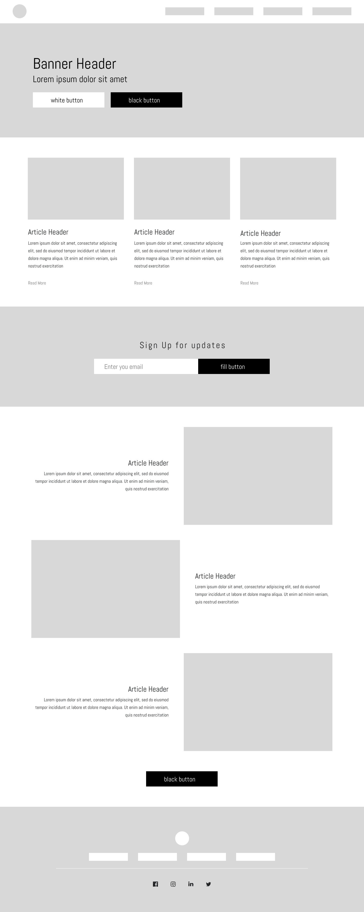

# BeeInterns-0-test-
# &lt;Тестовое задание по HTML/> 

## Требования 

Для проверки задания необходимо прислать ссылку на репозиторий с проектом.  

## Ссылка на макет 
<u>Перейти к [макету](https://www.figma.com/file/2P0LoSQImwZMpSQ21X0cis/BeeInterns%3AHTML%3ACSS?node-id=0%3A1)</u>

## Описание задания 

- Инструменты HTML5/CSS3 
- Классы должны иметь возможность переиспользоваться 
- При незначительных изменениях экрана вёрстка не должна расползаться 
- Вёрстка не должна иметь фиксированную ширину 
- Блок «Sign Up for updates» должен быть выполнен в соответствии со всеми требованиями к верстке форм

  
